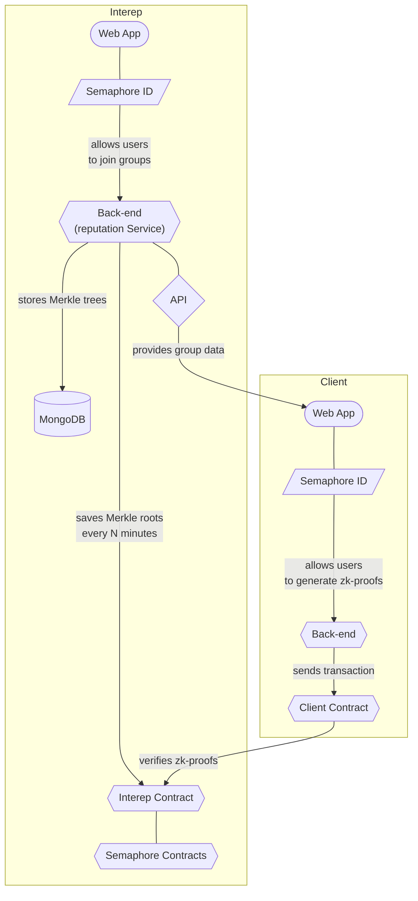

<p align="center">
    <h1 align="center">
        Interep Voting App
    </h1>
    <p align="center">Simple demo to allow only users of gold groups to vote anonymously in a ballot.</p>
</p>

<p align="center">
    <a href="https://github.com/interep-project" target="_blank">
        
    </a>
    <a href="https://github.com/interep-project/voting-app/blob/main/LICENSE">
        
    </a>
    <a href="https://eslint.org/" target="_blank">
        
    </a>
    <a href="https://prettier.io/" target="_blank">
        
    </a>
    
</p>

<div align="center">
    <h4>
        <a href="https://docs.interep.link/contributing">
            👥 Contributing
        </a>
        <span>&nbsp;&nbsp;|&nbsp;&nbsp;</span>
        <a href="https://docs.interep.link/code-of-conduct">
            🤝 Code of conduct
        </a>
        <span>&nbsp;&nbsp;|&nbsp;&nbsp;</span>
        <a href="https://discord.gg/Tp9He7qws4">
            🗣️ Chat &amp; Support
        </a>
    </h4>
</div>


| Interep is made of several components. The purpose of this demo is to show how to start integrating contracts and libraries, and how these components interact. This demo consists of a frontend, where users can create their own zero-knowledge proof for anonymous voting, and a backend, where an admin receives the anonymous proofs and sends transactions for onchain voting. |
| ------------------------------------------------------------------------------------------------------------------------------------------------------------------------------------------------------------------------------------- |

---

## Components



\* *Groups are Merkle trees*\
\* *Group members are Merkle tree leaves*\
\* *Merkle tree leaves are Semaphore IDs*\
\* *Semaphore ids are used to join groups and generate zk proofs*

## Usage

### 1. Setup

#### 1.1 Voting App

Clone this repository and install its dependencies:

```bash
git clone https://github.com/interep-project/voting-app.git && cd voting-app && yarn
```

#### 1.2 Interep Contracts & Reputation Service

Clone the [`contracts`](https://github.com/interep-project/contracts) and [`reputation-service`](https://github.com/interep-project/reputation-service) repositories and install their dependencies.

### 2. Compile

Compile the smart contracts  on `voting-app` and `contracts`:

```bash
yarn compile
```

### 3. Deploy

#### 3.1 Local network

Start an Hardhat network on `contracts`:

```bash
yarn start
```

#### 3.2 Deploy contracts

Deploy the smart contracts on `voting-app` and `contracts`:

```bash
yarn deploy
```

### 4. Web apps

Start the web apps on `voting-app` and `reputation-service`:

```bash
yarn dev
```
